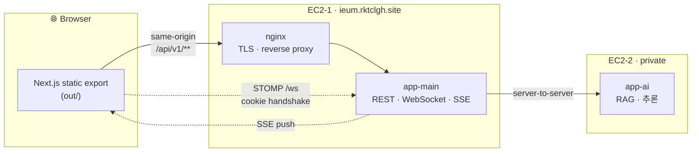
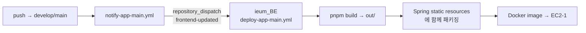

<div align="center">

# 이음 · Ieum

### 한국에 사는 외국인을 위한 위치 기반 커뮤니티

지도 위에서 **주변 모임에 참여**하고, **지역 질문을 주고받고**, **실시간으로 대화**합니다.<br/>
질문에는 AI가 먼저 답하고, 사람의 답변이 채택되면 그게 다시 지식이 됩니다.

<br/>

[](https://ieum.rktclgh.site)
[](https://github.com/rktclgh/ieum_BE)

<br/>

</div>

## Tech Stack

<div align="center">

**Core**


**State & Data**


**UI & Map**


</div>

| 구분 | 선택 | 왜 |
|---|---|---|
| 프레임워크 | **Next.js 16 (App Router)** · `output: "export"` | 운영 서버는 Spring 하나. Next는 **빌드 도구로만** 쓰고 `out/` 정적 산출물만 배포해 same-origin 유지 |
| 언어 | **TypeScript 5** (strict) | 백엔드 DTO 계약을 타입으로 고정 |
| 서버 상태 | **TanStack Query v5** | 커서 페이지네이션 · 무한스크롤 · 실시간 수신분과의 캐시 병합 |
| 클라 상태 | **Zustand 5** (persist) | 세션 · 언어 · 지도 뷰포트처럼 화면을 가로지르는 상태 |
| 실시간 | **@stomp/stompjs 7** | 채팅 · 채팅방 목록 갱신. 쿠키 인증으로 백엔드 직결 |
| 지도 | **Leaflet + MapLibre GL + supercluster** | 래스터 UX(Leaflet) 위에 벡터 타일(MapLibre)을 얹고, 핀은 클러스터링 |
| 스타일 | **Tailwind v4 + shadcn/ui + Base UI** | 디자인 토큰 기반, 모바일 퍼스트 |
| i18n | 자체 구현 (zustand persist + 메시지 카탈로그) | **7개 언어** — 외국인 타깃 서비스의 1급 요구사항 |
| 한글 | **es-hangul** · **Pretendard** | 초성 검색(`ㄱㄴ` → `강남`), 다국어 폰트 |
| PWA | manifest + Web Push | 홈 화면 설치 · 백그라운드 알림 |

<br/>

## 무엇을 만들었나

<table>
<tr><td width="33%" valign="top">

### 지도 홈
모임·질문 핀을 한 지도 위에. 클러스터링, 내 위치 따라가기(follow-me), 장소 검색·역지오코딩, 리스트 뷰 전환.

</td><td width="33%" valign="top">

### 모임
생성·상세·참여·강퇴(영구 밴)·마감. 참여하면 그룹 채팅방이 열리고, 일정 캘린더가 붙는다.

</td><td width="33%" valign="top">

### 질문 & 답변
질문을 올리면 **AI가 먼저 답한다**. 사람 답변 채택, 답변자와 1:1 꼬리질문 채팅.

</td></tr>
<tr><td valign="top">

### 실시간 채팅
STOMP 그룹·1:1 채팅. 답장, 공지 고정, 말풍선 그룹핑, 날짜 구분선, 읽음 기준선.

</td><td valign="top">

### 친구 · 알림
닉네임 초성 검색 친구 추가, 요청 수락/거절. SSE 실시간 알림 + Web Push.

</td><td valign="top">

### 운영자 대시보드
신고 검수, 유저 제재, 문의 처리, AI 지식 그래프 뷰어. 데스크톱 전용 레이아웃.

</td></tr>
</table>

**7개 언어** — 🇰🇷 한국어 · 🇺🇸 English · 🇯🇵 日本語 · 🇨🇳 中文 · 🇻🇳 Tiếng Việt · 🇹🇭 ไทย · 🇷🇺 Русский

<br/>

## 아키텍처



> 프론트는 **`/api/v1/**` 하나만 호출**한다. app-ai는 브라우저에 노출되지 않으며 쿠키도 전달되지 않는다.

### 디렉터리 — 도메인 캡슐화

```
src/
├── app/                    # 라우트 (얇게 — 컴포넌트 조립만)
├── features/               # 도메인 19개
│   └── <domain>/
│       ├── api/            #   백엔드 계약 타입 · 요청 함수
│       ├── hooks/          #   React Query 쿼리 · 뮤테이션
│       ├── lib/            #   어댑터 (서버 DTO → 뷰 모델) · 에러 매핑
│       ├── components/     #   도메인 UI
│       └── constants/      #   상수 · 검증 규칙
├── components/ui/          # 무상태 공용 프리미티브 (shadcn)
└── lib/                    # api client · i18n · query · viewport · date(KST)
```

도메인: `admin` `chat` `friends` `join` `language` `login` `map` `meetup` `my` `navigation` `notification` `profile-image` `pwa` `question` `report` `schedule` `session` `social-login` `translate`

**어댑터 레이어**가 핵심이다. 백엔드 DTO는 반드시 `lib/*-adapter.ts`를 통해 뷰 모델로 바뀐다 — API 스펙이 흔들려도 UI 컴포넌트까지 전파되지 않는다.

<br/>

## 설계 결정 몇 가지

<details>
<summary><b>동시 401이 세션을 통째로 날리던 문제 → refresh Promise 싱글턴</b></summary>

<br/>

한 화면에서 여러 쿼리가 병렬로 401을 받으면 각 인터셉터가 제각각 `/auth/refresh`를 쐈다. 백엔드의 refresh token rotation이 이를 **탈취 시도로 오인**해 세션 전체를 무효화했다.

모듈 스코프 Promise 싱글턴으로 해결:

```ts
refreshPromise ??= apiClient.post("/api/v1/auth/refresh")
  .finally(() => { refreshPromise = null })
await refreshPromise
return apiClient(config)   // 원 요청 재시도
```

병렬 6요청 재현 계측: refresh 호출 **6회 → 1회**, 강제 로그아웃 **6건 → 0건**. 요청이 늘수록 감소율은 N→1로 커진다.

</details>

<details>
<summary><b>인증 가드 — 2층 구조로 왕복 제거</b></summary>

<br/>

매 이동마다 `users/me`로 검증하면 정확하지만 왕복 1회가 강제된다. 클라이언트만 믿으면 하이드레이션 전 깜빡임이 난다.

- **1층**: 쿠키 *존재 여부*만 보는 값싼 필터로 명백한 케이스를 왕복 없이 리다이렉트
- **2층**: 실제 유효성은 진입한 페이지가 `users/me`로 확정

`startsWith` 오매칭(`/login-success` → `/login`)은 정확 일치 또는 `/path/` 하위만 잡는 `matchesPath`로 차단. 가드 목적의 인증 왕복 **1회 → 0회**.

</details>

<details>
<summary><b>STOMP가 Next rewrite를 못 타는 문제 → 쿠키로 백엔드 직결</b></summary>

<br/>

REST는 rewrite로 프록시했지만 WebSocket 업그레이드는 rewrite와 궁합이 나쁘다. `http→ws` 스킴 변환으로 백엔드에 직접 붙고, 인증은 핸드셰이크에 자동으로 실리는 `access_token` 쿠키가 처리한다. 핸들러는 ref에 담아 구독 콜백이 참조하게 해 매 렌더 재구독을 막았다.

</details>

<details>
<summary><b>런타임 ID는 path가 아니라 query</b></summary>

<br/>

정적 export라 빌드 시점에 ID를 열거할 수 없다. `/questions/detail/?questionId=123` 형태로 고정 path + query를 쓴다. route builder(`src/lib/navigation/routes.ts`)가 positive safe integer만 받고 아니면 `RangeError`를 던진다. 잘못된 ID에서는 data component를 아예 mount하지 않아 API·WebSocket 요청도 시작되지 않는다.

</details>

<br/>

## 시작하기

```bash
# 요구사항: Node 20+, pnpm 10+
pnpm install

cp .env.local.example .env.local     # 백엔드 origin 등 설정
pnpm dev                              # http://localhost:3000
```

### 스크립트

| 명령 | 하는 일 |
|---|---|
| `pnpm dev` | 개발 서버 |
| `pnpm build` | 정적 export → `out/` |
| `pnpm typecheck` | `next typegen` + `tsc --noEmit` |
| `pnpm lint` | ESLint |
| `pnpm test:contracts` | 계약 테스트 (세션 인터셉터 · 라우트 · i18n · 지도 · 관리자) |
| `pnpm check:layout` | 레이아웃 계약 검사 |
| `pnpm verify:out` | 정적 export 산출물 검증 |
| **`pnpm verify`** | **위 전부를 순서대로** — PR 전에 이거 하나만 |
| `pnpm gen:map-glyphs` | 지도 폰트 글리프 빌드 |
| `pnpm gen:flag-sprite` | 국기 스프라이트 빌드 (199개국) |

### 계약 테스트

`scripts/ci/`에는 UI 스냅샷 대신 **계약**을 지키는 테스트들이 있다 — 세션 인터셉터의 dedup·재시도, 정적 export 라우트 인벤토리, 7개 언어 메시지 키 누락, 지도 소스 설정, 관리자 화면 소스 규칙. 렌더링이 아니라 *깨지면 조용히 배포되는 것들*을 잡는다.

<br/>

## 배포



프론트 저장소는 빌드 산출물을 따로 호스팅하지 않는다. 백엔드 배포 워크플로가 프론트를 빌드해 **같은 이미지 안에 정적 리소스로 넣는다**. 그래서 운영은 완전한 same-origin이고 CORS 설정 자체가 없다.

| 항목 | 값 |
|---|---|
| 운영 URL | https://ieum.rktclgh.site |
| 라우트 | 29개 (전부 정적) |
| 배포 형태 | Spring 정적 서빙 (`out/`) |

<br/>

## 규모

<div align="center">

| TypeScript 파일 | LOC | 도메인 | 라우트 | 지원 언어 |
|:---:|:---:|:---:|:---:|:---:|
| **455** | **~44,000** | **19** | **29** | **7** |

</div>

<br/>

## 문서

| 문서 | 내용 |
|---|---|
| [`docs/ROUTES.md`](docs/ROUTES.md) | 라우트 계약 — URL · 화면 · 백엔드 API · 접근 권한 |
| [`docs/map-implementation.md`](docs/map-implementation.md) | 지도 구현 상세 |
| [`docs/viewport-behavior.md`](docs/viewport-behavior.md) | 모바일 뷰포트 · 키보드 인셋 처리 |
| [`docs/superpowers/`](docs/superpowers/) | 기능별 설계서 · 실행 계획 |

> 라우트를 추가·변경하면 `docs/ROUTES.md`를 **같은 PR에서** 갱신한다.

<br/>

---

<div align="center">

**신한 해커톤 3기** · 이음(Ieum) Frontend

</div>
