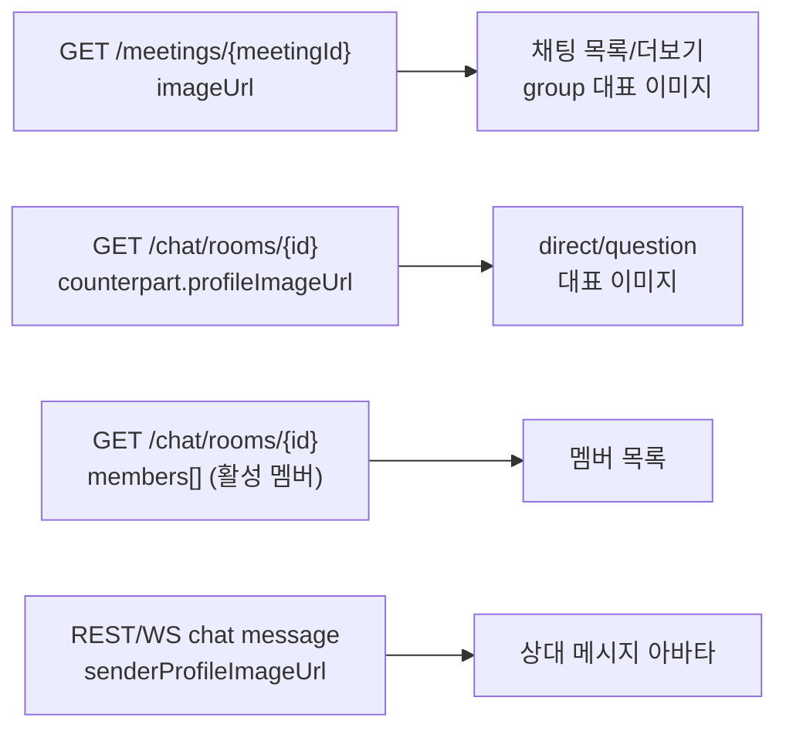

# 채팅방 대표 이미지·발신자 아바타 렌더링 설계

## 문제 정의

채팅 화면에는 서로 다른 의미의 이미지가 섞여 있다.

- 개인 채팅방의 대표 이미지는 대화 상대의 프로필 사진이어야 한다.
- 모임 채팅방의 대표 이미지는 특정 참여자의 사진이 아니라 모임 사진이어야 한다.
- 질문 채팅방도 채택 뒤 생성되는 1:1 대화이므로 대표 이미지는 대화 상대의 프로필 사진이어야 한다.
- 메시지 왼쪽 아바타는 현재 방에 남아 있는 멤버 목록이 아니라 **해당 메시지를 보낸 사용자**의 프로필을 보여야 한다. 그래야 이탈한 사용자의 과거 메시지도 빈 아바타가 되지 않는다.

이 문서는 GitHub 이슈 #169의 구현 기준이다.

## 목표와 비목표

### 목표

1. `/chats` 목록과 채팅방 더보기 상단의 대표 이미지를 방 유형별로 일관되게 렌더링한다.
2. 상대 메시지의 26px 아바타를 발신자 ID가 아닌 메시지 응답의 발신자 프로필 URL로 렌더링한다.
3. 로컬 개발과 운영 모두 기존 `resolveFileUrl`을 통해 파일 URL을 정규화한다.
4. 상대가 나간 뒤에도 남아 있는 사용자의 direct/question 방 대표 이미지가 빈 아바타가 되지 않게 한다.
5. 프로필 사진 또는 모임 사진이 없으면 기존 빈 아바타 폴백을 유지한다.

### 비목표

- 채팅방 입·퇴장, 메시지 가시성, 친구 관계, 파일 권한을 변경하지 않는다.
- 활성 멤버만 반환하는 `members`의 의미를 바꾸거나, 나간 사용자를 목록에 다시 노출하지 않는다.
- 메시지 테이블에 프로필 사진 스냅샷을 저장하거나 DB 마이그레이션을 추가하지 않는다.
- 메시지마다 사용자 프로필을 별도 조회하는 N+1 요청을 만들지 않는다.

## 화면·상태 설계

| 화면/요소 | direct | group | question |
| --- | --- | --- | --- |
| 채팅 목록 대표 이미지 | 대화 상대 프로필 | 모임 사진 | 기존 대화 상대 프로필 |
| 더보기 상단 대표 이미지 | 대화 상대 프로필 | 모임 사진 | 대화 상대 프로필 |
| 상대 메시지 아바타 | 메시지 발신자 프로필 | 메시지 발신자 프로필 | 메시지 발신자 프로필 |

`group`에 모임 사진이 없을 때 참여자 프로필로 대체하지 않는다. 대표 이미지의 의미가 모임 자체이기 때문이다. 이 경우 컴포넌트의 빈 원형 폴백을 그대로 사용한다.

## 데이터 흐름과 계약



### 방 대표 이미지

프론트엔드 순수 헬퍼는 이미 정규화된 URL만 받는다.

```ts
resolveChatRoomAvatar(roomType, members, myUserId, meetingAvatarSrc, counterpart)
```

- `group`이면 `meetingAvatarSrc`만 반환한다.
- `direct`와 `question`이면 `counterpart`의 `avatarSrc`를 우선하고, 이전 백엔드 응답 호환을 위해 활성 `members`에서 `myUserId`가 아닌 멤버를 폴백으로 찾는다.
- URL 정규화는 API 경계에서 단 한 번 `resolveFileUrl`로 수행한다.

방 상세 응답은 기존 활성 멤버 목록과 별도로, direct/question에만 `counterpart`를 nullable하게 제공한다.

```ts
interface ChatRoomDetailResponse {
  members: ChatRoomMemberResponse[] // 활성 멤버만
  counterpart?: ChatRoomMemberResponse | null // 나간 경우에도 현재 사용자가 아닌 1:1 상대
}
```

`counterpart`는 멤버십 상태나 재입장 정책이 아니다. 현재 사용자가 방에 남아 있을 때 대표 이미지를 결정하기 위한 1:1 상대 메타데이터다. `group`은 `null`이며, 나간 사용자는 여전히 자신의 채팅 목록에서 제거된다.

### 메시지 발신자 아바타

백엔드는 REST 메시지, 방 목록의 `lastMessage`, STOMP 메시지 이벤트에 동일한 nullable 필드를 추가한다.

```ts
interface ChatMessageResponse {
  senderProfileImageUrl: string | null
}

interface WsMessageEvent {
  senderProfileImageUrl: string | null
}
```

프론트 `adaptMessage`는 이 필드를 `avatarSrc`로 정규화하고, `buildMessageRuns`는 묶음 첫 메시지의 `avatarSrc`를 `ChatMessageGroup`에 전달한다. 현재 활성 멤버 목록은 방 대표 이미지와 멤버 목록에만 사용한다.

### 프로필 URL의 시간 의미

`senderProfileImageUrl`은 메시지 생성 당시의 스냅샷이 아니라 조회/발행 시점의 사용자 프로필 파일 ID를 사용한다. 제품 요구가 “대화 상대 프로필 사진”이므로, 프로필 변경 후에는 과거 메시지도 현재 프로필을 보여 준다. 프로필이 제거됐으면 `null`과 기존 빈 아바타가 맞다.

## 경계 조건

- 이탈한 발신자: 방 상세 API는 활성 멤버만 반환하므로 메시지 API 필드로 렌더링한다.
- 이탈한 1:1 상대: `members`에서는 제외하되 `counterpart`로 대표 이미지만 유지한다. 남아 있는 사용자의 목록/더보기만 이 값을 사용한다.
- 본인 메시지: 데이터에는 URL이 있어도 UI는 본인 아바타를 렌더링하지 않는다.
- 모임 사진 없음: group 대표 이미지가 `undefined`가 되어 빈 아바타가 표시된다.
- 프로필 사진 없음: direct/question 대표 이미지가 `undefined`가 되어 빈 아바타가 표시된다.
- 파일 URL: 상대/이탈 여부에 따른 권한 분기를 추가하지 않으며, 로그인 쿠키가 있는 기존 파일 스트림 경로를 사용한다.

## 구현 단위와 검증

### 프론트엔드

- `src/features/chat/lib/chat-avatar.ts`: 방 유형별 대표 이미지 선택을 순수 함수로 고정한다.
- `src/features/chat/lib/chat-adapter.ts`, `hooks/use-chat-queries.ts`: 목록의 모임 이미지를 전달하고 메시지 프로필 URL을 뷰 모델로 변환한다.
- `components/chat-room-page-content.tsx`: 더보기 상단과 메시지 묶음에 선택된 URL을 연결한다.
- `scripts/ci/test-chat-avatar.ts`: direct/group/question 대표 이미지 선택과 빈 폴백을 회귀 테스트한다.

### 백엔드

- `ChatMessageResponse`와 `WsMessageEvent`에 `senderProfileImageUrl`을 추가한다.
- DTO 생성 시 공통 `ProfileImageUrls.of(sender)`를 사용한다.
- REST 메시지, 목록의 마지막 메시지, STOMP 이벤트가 같은 필드를 전달하는지 서비스·컨트롤러·웹소켓 테스트로 검증한다.

## 수용 기준

- 개인 채팅 목록/더보기에서 대화 상대의 프로필 사진이 렌더링된다.
- 모임 채팅 목록/더보기에서 모임 사진이 렌더링되고, 참여자 사진으로 대체되지 않는다.
- 질문 채팅방 목록/더보기에서 대화 상대의 프로필 사진이 렌더링된다.
- 상대가 나간 direct/question 방에서도 남아 있는 사용자의 대표 프로필 이미지가 유지되고, 활성 멤버 목록에는 나간 사용자가 추가되지 않는다.
- 활성/이탈 발신자 모두의 과거 메시지 아바타가 메시지 계약의 프로필 URL로 렌더링된다.
- 사진이 없는 경우 빈 아바타 외의 잘못된 이미지나 오류 요청이 발생하지 않는다.
- 프론트 계약 테스트·린트·타입 검사·정적 산출물 검증과 백엔드 채팅 계약 테스트가 통과한다.
