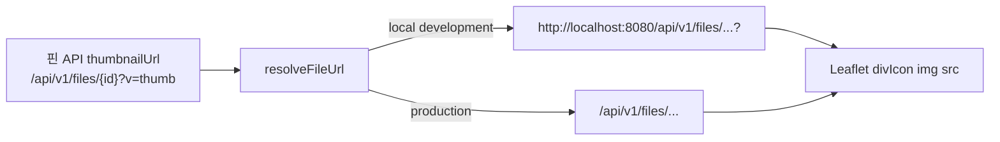

# 지도 모임 핀 썸네일 URL 정상화 설계

이 문서는 GitHub 이슈 #195의 구현 기준이다.

## 문제 정의

모임 상세와 검색 결과 카드의 이미지는 정상 렌더링되지만, Leaflet 지도 마커 안의 모임 썸네일만 로컬 개발 환경에서 깨진다.

핀 API가 반환하는 `thumbnailUrl`은 `/api/v1/files/{id}?v=thumb` 형태의 상대 경로다. 상세와 카드 화면은 기존 `resolveFileUrl`을 거쳐 개발 서버에서는 Spring(`localhost:8080`)으로 요청한다. 반면 마커는 Leaflet `divIcon`의 raw HTML에 상대 경로를 그대로 넣어 Next 개발 서버(`localhost:3000`)가 해당 요청을 받아 404를 반환한다.

파일의 S3 원본·display·thumbnail 생성, DB 연결, Spring 파일 스트림 API는 변경 대상이 아니다.

## 목표와 비목표

### 목표

1. 모임 지도 마커의 상대 파일 URL을 기존 `resolveFileUrl`로 정규화한다.
2. 로컬 개발에서는 마커 이미지 요청이 백엔드 origin으로 향하게 한다.
3. 운영에서는 기존 same-origin 상대 경로 동작을 유지한다.
4. `thumbnailUrl`이 없을 때 기존 빈 원형 폴백을 유지한다.
5. raw 상대 경로를 다시 마커 HTML에 넣지 못하게 소스 계약 테스트로 고정한다.

### 비목표

- 핀 API, 파일 API, S3 업로드·썸네일 생성, DB 스키마를 변경하지 않는다.
- Next rewrite를 추가하거나 static export 설정을 바꾸지 않는다.
- 질문 핀의 시각 표현이나 클러스터 마커 동작을 바꾸지 않는다.
- Leaflet 컴포넌트를 테스트 편의만을 위해 새 계층으로 분리하지 않는다.

## 대안과 선택

| 대안 | 판단 |
| --- | --- |
| 백엔드가 절대 URL을 반환 | 개발 환경 문제를 API 계약으로 전파하고 운영 origin 의존성을 만든다. 채택하지 않는다. |
| Next `/api` rewrite 추가 | static export 구성과 전역 API 요청 경로에 영향을 준다. 범위가 과도하다. 채택하지 않는다. |
| 마커에서 기존 `resolveFileUrl` 재사용 | 상세·카드와 URL 해석 규칙을 하나로 유지하며 변경 범위가 두 파일에 한정된다. 채택한다. |

## 데이터 흐름

`pin-marker.tsx`는 `pin.thumbnailUrl`을 곧바로 HTML 속성에 쓰지 않는다. 먼저 `resolveFileUrl(pin.thumbnailUrl)`의 반환값을 구하고, 값이 있을 때만 기존 `escapeAttr`를 적용해 ``에 넣는다.

`resolveFileUrl`은 `null`·`undefined`에 `undefined`를 반환하고, 이미 절대 URL인 경우 값을 보존한다. 따라서 사진 없는 모임의 빈 원형 폴백과 백엔드가 절대 URL을 제공하는 호환 동작도 유지된다. URL 정규화 뒤에도 HTML attribute escaping은 유지하므로 HTML 주입 방어와 기존 `%` 인코딩 보존도 변하지 않는다.

## 테스트와 수용 기준

Leaflet은 브라우저 DOM을 요구하고 현재 저장소에는 DOM 컴포넌트 테스트 런너가 없다. 기존 `scripts/ci/test-map-source-contracts.mjs`는 map TSX의 구조적 계약을 검사하고 `scripts/ci/test-map-contracts.sh`에서 실행되므로, 다음을 회귀 계약으로 추가한다.

- `pin-marker.tsx`가 `resolveFileUrl`을 import한다.
- 마커가 `resolveFileUrl(pin.thumbnailUrl)` 값을 만든다.
- ``가 정규화된 값을 `escapeAttr`로 이스케이프한다.
- raw `escapeAttr(pin.thumbnailUrl)` 사용은 남지 않는다.

완료 시 `node --test scripts/ci/test-map-source-contracts.mjs`, `bash scripts/ci/test-map-contracts.sh`, `pnpm lint`, `pnpm typecheck`가 통과해야 한다.
