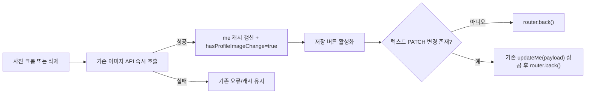

# 프로필 사진 변경 저장 버튼 활성화 설계

이 문서는 GitHub 이슈 #200의 구현 기준이다.

## 문제

`/my/edit`에서 프로필 사진을 바꾸거나 삭제해도 저장 버튼이 활성화되지 않는다.

현재 사진 변경은 폼의 `UpdateMeRequest`에 포함되지 않는다. 크롭 완료 후 `useProfileImageUpload`가 파일 업로드와 `PUT /users/me/profile-image`를 즉시 수행하고, 삭제도 별도 `DELETE /users/me/profile-image`로 즉시 수행한다. 성공 시 `['me']` 캐시의 `profileImageUrl`은 갱신되지만, 폼의 `hasChanges`는 닉네임·생년월일·성별·국적으로 만든 PATCH payload만 보므로 사진 변경을 알 수 없다.

## 목표

1. 사진 업로드 또는 삭제가 성공하면 저장 버튼을 활성화한다.
2. 사진만 바뀐 경우 빈 `PATCH /users/me {}`를 보내지 않는다.
3. 텍스트 변경과 사진 변경이 함께 있으면 기존 PATCH 저장 뒤 화면을 닫는다.
4. 사진 업로드·삭제 실패는 저장 가능 상태를 만들지 않는다.
5. 기존 즉시 사진 저장, `['me']` 캐시 갱신, 업로드 실패 안내를 유지한다.

## 비목표

- 사진 업로드를 저장 버튼 클릭 시점까지 지연하지 않는다.
- 프로필 이미지 API, S3 업로드, 백엔드 계약, DB를 변경하지 않는다.
- 실패한 삭제의 새 오류 UI나 업로드 취소·파일 정리 정책을 추가하지 않는다.
- 사진 업로드 진행 중 텍스트 저장 UX를 재설계하지 않는다.

## 상태와 흐름

폼은 `hasProfileImageChange`라는 로컬 boolean을 가진다. 이는 서버의 현재 이미지 URL 비교가 아니라 **현재 폼 세션에서 사진 변경 API가 성공했는지**를 나타내는 확인 대기 상태다. `useMe` 캐시가 변경되어 컴포넌트가 다시 렌더되어도 상태는 유지된다.



텍스트 변경 여부는 `hasTextChanges = Object.keys(payload).length > 0`로 분리한다. 최종 저장 가능 상태는 `hasTextChanges || hasProfileImageChange`와 기존 폼 유효성·`updateMe` pending 조건을 함께 만족해야 한다.

## 경계 조건

- 업로드 성공 뒤: 이미지 API가 이미 완료됐으므로 저장 버튼은 활성화되고, 사진만 바뀌었으면 확인 클릭은 화면 복귀만 수행한다.
- 삭제 성공 뒤: 같은 방식으로 저장 버튼을 활성화한다.
- 업로드 실패·삭제 실패: 성공 플래그를 바꾸지 않으므로 사진만으로는 저장 버튼이 활성화되지 않는다.
- 텍스트와 사진을 함께 바꾼 경우: 빈 요청 대신 기존 `payload`를 한 번 PATCH한다.
- 텍스트만 바꾼 기존 흐름과 사진 없는 사용자 흐름은 변경하지 않는다.

## 검증

브라우저 DOM 테스트 런너가 없는 현재 저장소의 관례에 맞춰 `scripts/ci/test-static-source-contracts.mjs`에 회귀 계약을 추가한다. 테스트는 업로드·삭제 성공 후 플래그 설정, `hasChanges` 포함, 사진 전용 제출의 `router.back()` 분기, 기존 PATCH 경로를 확인한다.

완료 전 다음을 실행한다.

```bash
node --test scripts/ci/test-static-source-contracts.mjs
pnpm test:contracts
pnpm typecheck
pnpm exec next build --webpack
```
